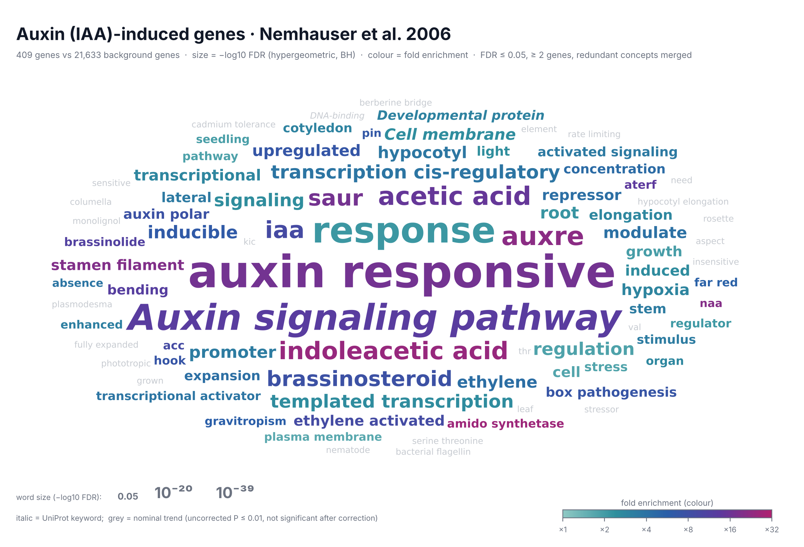
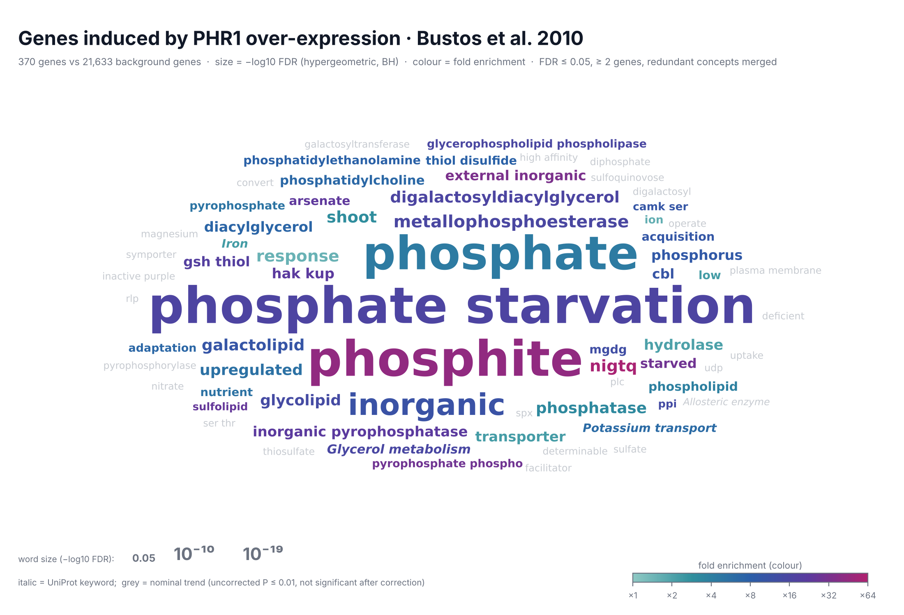
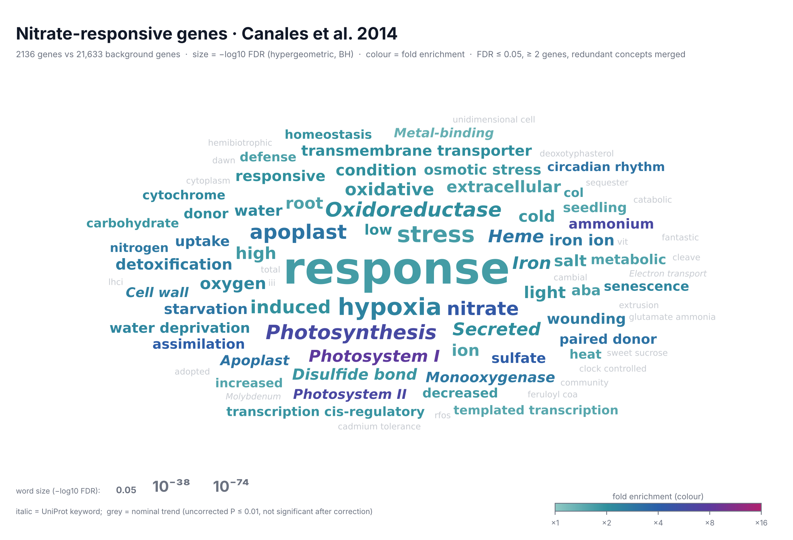
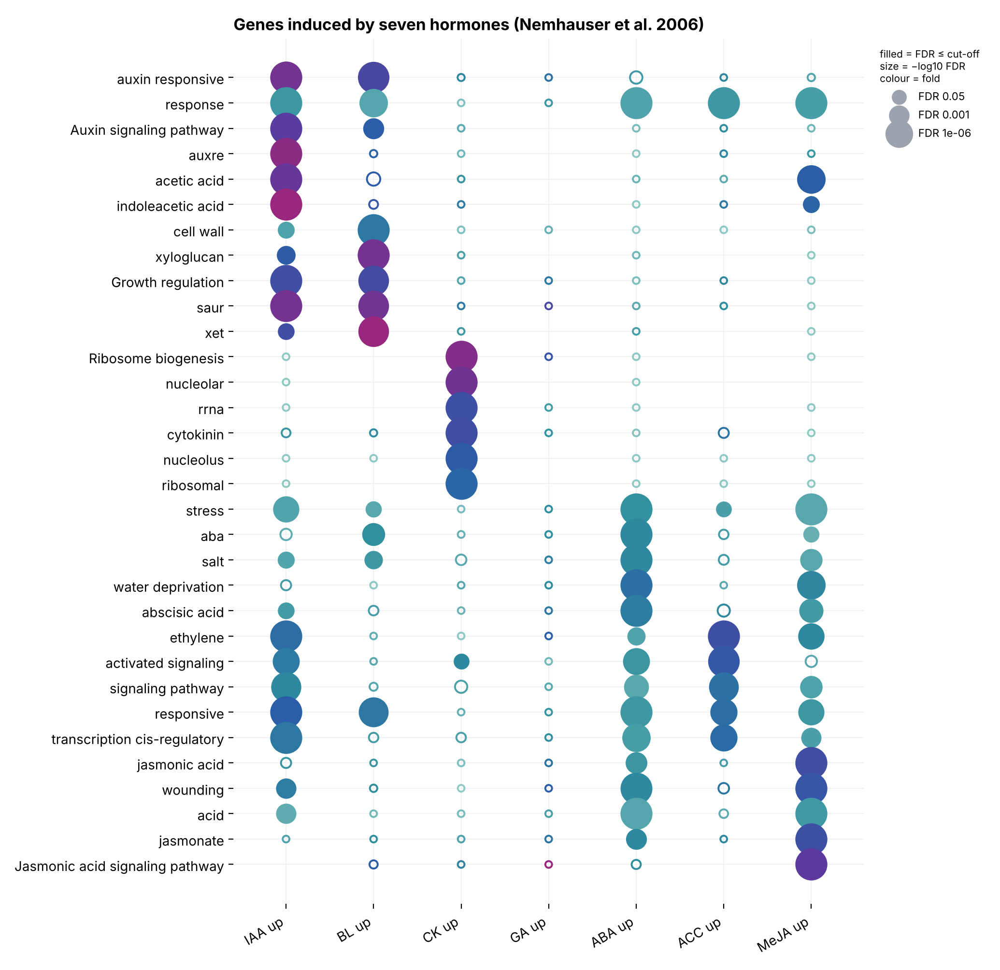

# GeneCloud 2

**Semantic enrichment word clouds for gene lists.** Give GeneCloud a list of genes (a cluster, a set of
differentially expressed genes…) and it tells you, in words, what these genes have in common: which words and
phrases of their functional annotation are over-represented compared with the genome, with proper statistics,
drawn as a word cloud in which **the size of each word is its statistical enrichment**.

GeneCloud 2 is a complete rewrite of GeneCloud (G. Krouk, 2013, R package `GeneCloud.gb`; Krouk et al. 2015,
*Mol. Plant*) with an up-to-date genome annotation and a modern statistical engine.

**▶ Online version: <https://gabkrouk.github.io/genecloud/>** — paste a gene list, choose a background, get the
cloud, the table and the genes behind every word. Everything is computed in the browser: gene lists never leave
the user's computer.

**Annotation 2026.** For Arabidopsis the annotation combines the most recent TAIR public data release
(Araport11 short descriptions, **TAIR curator summaries**, computational descriptions, gene symbols and full names,
**mutant phenotypes**, gene types; release `TAIR_Data_20250930`, published 2026-10-01) with UniProtKB, NCBI Gene and
the Gene Ontology.



## What is new compared with GeneCloud 2013

| | GeneCloud (2013) | GeneCloud 2 |
|---|---|---|
| Annotation | TAIR gene descriptions frozen in Dec 2012, bundled | Rebuilt on demand from the latest **TAIR public data release** (Araport11 descriptions, curator summaries, phenotypes, symbols), **UniProtKB** (protein names, curated FUNCTION text, keywords, families), **NCBI Gene** and the **Gene Ontology**. All CC BY 4.0 / public domain |
| Unit of counting | every occurrence of a word (a long description weighs more) | **genes** carrying the concept (one gene = one vote) |
| Concepts | single words | words (lemmatised: *transporters* → *transporter*), **two-word phrases** detected genome-wide by normalised PMI (*high affinity*, *plasma membrane*, *xenobiotic detoxification*), **UniProt keywords**, optionally **GO terms** (with ancestors) |
| Statistics | 100 random gene lists drawn from the whole genome; significant if never reached (P < 0.01 at best), no multiple-testing correction | exact **hypergeometric test** against a **mandatory background** (the genes that could have been in the list), **Benjamini–Hochberg** (or Benjamini–Yekutieli) FDR over a family fixed by the background only, computed in log scale (exact below 10⁻³⁰⁰), fold enrichment |
| Noise | gene names, numbers and identifiers appear as "significant" | identifiers, numbers, evidence tags and annotation boilerplate removed; a concept must be carried by ≥ 2 genes; over-general concepts (> 25 % of background) are not tested |
| Redundancy | *ammonium*, *ammonium transporter*, *amt11* … all shown | redundant concepts carried by the same genes are **merged** (the most significant represents the group); lone words are shown with the phrase their genes share (*distance* → *long distance*) |
| Word size | word frequency | **−log10 FDR** (or log2 fold enrichment for long lists); colour = fold enrichment; size and colour keys drawn; nominal trends optionally in grey |
| Layout | random | deterministic spiral layout (same input → same picture) |
| Outputs | PDF (by e-mail, from a web server) | **web application** running in the browser; PDF / PNG / SVG, a **self-contained interactive HTML** report (hover a word for its statistics, click it to see its genes), TSV tables, FASTA-like gene lists per term, and a **multi-set comparison** dot plot |
| Reproducibility | — | the original 2013 test is kept (`genecloud legacy`) to compare both methods on the same annotation |

## Install

```bash
pip install git+https://github.com/GabKrouk/genecloud
# or, from a clone:
pip install -e ".[test]"
```

Python ≥ 3.9; dependencies: numpy, pandas, scipy, matplotlib.

## Quick start

```bash
# 1. build the annotation once (~40 MB download from TAIR, UniProt, NCBI and GO; ~10 s to parse)
genecloud build --species arabidopsis --out arabidopsis.jsonl.gz

# 2. one gene list + its background -> cloud + interactive report + table
genecloud run my_cluster.txt -a arabidopsis.jsonl.gz -b expressed_genes.txt -o results/cluster1

# 3. several lists at once (two-column file: gene <TAB> set) -> one cloud per set + comparison dot plot
genecloud compare clusters.tsv -a arabidopsis.jsonl.gz -b expressed_genes.txt -o results/clusters
```

The background (`-b/--background`, or `background=` in Python) is **required**: it is the list of genes
that *could* have appeared in your list — every gene detected in the RNA-seq, every gene on the array.

Gene files can contain one identifier per line or any text: identifiers are recognised by pattern
(`AT1G01010`, `At1g01010.1` …); lines starting with `#` are ignored.

From Python:

```python
from genecloud import GeneCloud

gc = GeneCloud("arabidopsis.jsonl.gz", layers=("word", "phrase", "keyword"), text_fields="all")
res = gc.run(genes, background=expressed, fdr=0.05, min_genes=2)          # adjust="BY" for Benjamini-Yekutieli
res.significant            # pandas DataFrame: concept, k/n, K/N, fold, P, FDR, genes, merged synonyms
gc.plot(res, "cloud.pdf", title="Cluster 2")
gc.html(res, "cloud.html", title="Cluster 2")
```

Which annotation texts feed the words and phrases is chosen with `--text` / `text_fields=`:

| preset | texts |
|---|---|
| `all` (default) | TAIR short descriptions, curator summaries, computational descriptions, phenotypes + NCBI description and names + UniProt protein names, FUNCTION, families + GO term names |
| `tair` | TAIR only (closest to GeneCloud 2013/2015, which used TAIR descriptions, but with 2025 text) |
| `open` | UniProt + NCBI + GO (the GeneCloud 2.0 set) |

## Online version (web application)

`web/` is a static site (HTML + JavaScript, no server) published with GitHub Pages at
<https://gabkrouk.github.io/genecloud/>. It reproduces the 2015 GeneCloud page (gene list, options, submit) and
its results: the cloud (optionally with `term(count|fold)` labels as in 2015), the table of over-represented
terms (count, enrichment ratio, p-value, FDR, sortable) and, for every term, the genes that carry it with their
TAIR descriptions, curator summary, UniProt function and phenotypes, the term highlighted (Fig. 1D–E of the
paper). Downloads: SVG, PNG, TSV, FASTA-like gene lists per term; an analysis can be shared as a link.

The browser engine (`web/engine.js`) is a line-by-line port of `GeneCloud.run`; `tests/web/test_engine.mjs`
checks that it returns **exactly the same table** (rows, counts, P, FDR, order, merging, displayed words) as the
Python package on the paper examples with several option sets. The data files are written by:

```bash
genecloud export-web -a arabidopsis.jsonl.gz -o web/data --flag ATH1=examples/lists/background_ATH1.txt
cd web && python -m http.server        # local preview at http://localhost:8000
```

## How it works

1. **Annotation.** For every gene, GeneCloud gathers its TAIR texts (Araport11 short description, curator
   summary, computational description, symbols, full names and mutant phenotypes), its NCBI description and
   nomenclature names, UniProt protein names, curated FUNCTION paragraph, families and keywords, and the names of
   its direct GO annotations. Evidence tags (`PubMed:…`, `{ECO:…}`), EC numbers and gene identifiers are
   stripped. TAIR texts of all gene models of a locus are merged.
2. **Concepts.** Text is lower-cased, split at punctuation and stop words (English + annotation boilerplate such
   as *protein*, *putative*, *involved*, *family*), and lightly lemmatised. Compound prefixes are kept
   (*trans-Golgi*). Two-word phrases that co-occur far more than expected across the genome (normalised PMI ≥ 0.35,
   ≥ 5 genes) become concepts too. Each gene is reduced to a **set** of concepts.
3. **Test.** Universe = genes annotated in the chosen concepts ∩ background (*N* genes). For each concept carried
   by *k* of the *n* study genes and *K* of the *N* background genes, P = hypergeometric upper tail P(X ≥ k),
   computed in log scale. The family of hypotheses is fixed by the background only: every concept with
   `min_genes` ≤ *K* ≤ 25 % of *N*. Concepts absent from the list, or carried by fewer than `min_genes` study
   genes, enter the correction with P = 1. FDR: Benjamini–Hochberg (default) or Benjamini–Yekutieli (valid under
   any dependence between nested concepts). A concept is significant when *k* ≥ `min_genes` and FDR ≤ cut-off.
4. **Redundancy.** Significant concepts are visited from the most to the least significant; a concept joins an
   earlier one when their study genes overlap with Jaccard ≥ 0.75, or when the words of one are contained in the
   other and they share at least half of the genes of the larger one (*high* → *high affinity*, but *phosphate*
   is not absorbed by *pentose phosphate*). The cloud shows one word per group; the table lists the merged
   synonyms. A lone word is shown with the phrase that ≥ 90 % of its genes share (*distance* → *long distance*).
5. **Cloud.** Word size grows linearly with −log10 FDR (from the cut-off to the most significant term), or with
   log2 fold enrichment (`--size-by fold`, better for long lists where FDR mostly reflects list size); colour =
   fold enrichment (colour-blind-friendly ramp); both keys are drawn. Italic = UniProt keyword; grey = nominal
   trend (uncorrected P ≤ 0.01: a lead, not a finding). Words are placed on a deterministic spiral and the font
   scale shrinks until every significant concept fits.

### Verification

* `pytest`: exact hypergeometric P against integer enumeration, BH/BY against direct implementations, log-scale
  P below 10⁻³⁰⁰, background-only hypothesis family, TAIR parsing, CLI.
* `node tests/web/test_math.mjs`: the browser hypergeometric test against 3,004 scipy values.
* `tests/web/make_reference.py` + `node tests/web/test_engine.mjs`: browser engine = Python engine on the paper
  examples (six option sets, BH and BY).
* `scripts/check_layout.py`: no overlapping words, nothing outside the figure or on the colour bar, every top
  significant term drawn (light and dark themes, both size modes).

### Choosing the background

The background is mandatory. Pass the genes that *could* have been in your list: all genes detected in the
RNA-seq, or all genes represented on the microarray. Using the whole genome instead inflates enrichment for
anything associated with expression in your tissue or with presence on the array.

### Good practice

* Small sets (< 15 genes) rarely reach significance after FDR correction; look at the trends, and at the
  `genes` column: a concept carried by 2 genes is a lead, not a conclusion.
* GeneCloud complements, not replaces, GO enrichment: its strength is to surface **vocabulary that no ontology
  term captures** (a protein family, a transported molecule, a phenotype described in UniProt).

## Examples: the lists of the GeneCloud paper

`examples/` re-runs the three analyses of the original GeneCloud paper
(Krouk, Carré, Fizames, Gojon, Ruffel & Lacombe, 2015, *Mol. Plant* 8:971,
[doi:10.1016/j.molp.2015.02.005](https://doi.org/10.1016/j.molp.2015.02.005)) with GeneCloud 2.
All lists come from ATH1 microarrays, so the background is every gene on the ATH1 array
(`examples/lists/background_ATH1.txt`, 21,633 annotated genes). Annotation 2026, all texts, BH FDR ≤ 0.05.

```bash
genecloud build --species arabidopsis --out arabidopsis.jsonl.gz
python examples/run_examples.py arabidopsis.jsonl.gz                # -> examples/results/, examples/images/
python examples/prepare_lists.py SOURCE_DIR                         # optional: rebuild the lists from the public files
```

| list | source | genes | 2015 paper found | GeneCloud 2 (annotation 2026): top concepts (FDR) |
|---|---|---|---|---|
| auxin (IAA)-induced | Nemhauser et al. 2006 *Cell*, Table S5 | 430 | *auxin* (P = 3·10⁻¹⁴) | **auxin responsive** (6·10⁻⁴⁰; *auxin* alone 4·10⁻³⁷), Auxin signaling pathway, AuxRE, acetic acid / indoleacetic acid, Aux/IAA, SAUR, brassinosteroid |
| induced by PHR1 over-expression | Bustos et al. 2010 *PLoS Genet*, GSE20955: OxPHR1 vs *phr1*, ≥ 2-fold, t-test P < 0.05 | 381 | *phosphate*, *purple*, *glutaredoxin*, *phosphatase* | **phosphate starvation** (8·10⁻²⁰), phosphite, **phosphate** (5·10⁻¹⁸), inorganic, **purple** acid / metallophosphoesterase (5·10⁻⁴), **phosphatase** (3·10⁻⁴), **glutaredoxin** (0.048), galactolipids (DGDG, MGDG), NIGT/HHO GARP repressors |
| nitrate-responsive | Canales et al. 2014 *Front. Plant Sci.*, Table S1 (meta-analysis) | 2,264 | *nitrate*, *shaqkyf* (Wang et al. 2004 lists) | response, hypoxia, stress, photosynthesis, apoplast, **nitrate** (2·10⁻²²), ammonium (8·10⁻¹²), nitrite (3·10⁻⁸), NIGT (the SHAQKYF-class GARP factors, 0.004) |





The seven hormone treatments of Nemhauser et al. (2006), induced genes, compared in one dot plot: each hormone
is recognised by its own vocabulary (auxin, brassinosteroid → cell wall / xyloglucan, cytokinin, abscisic acid,
ethylene, jasmonic acid / glucosinolate). Gibberellin (40 genes) gives little, as in the original study.



Notes on the examples

* The 2015 nitrate example used the WT and NR-null lists of Wang et al. (2004, *Plant Physiol.* 136:2512), whose
  supplementary tables are not openly downloadable. It is replaced here by the nitrate-responsive genes of the
  Canales et al. (2014) meta-analysis of 27 ATH1 nitrate-treatment experiments.
* *shaqkyf* came from the 2012 TAIR descriptions of GARP/MYB-related proteins ("… SHAQKYF class"). Today the
  word survives in only 3 TAIR curator summaries, but the same genes are now described as NIGT/HHO GARP
  repressors of nitrate and phosphate signalling, and *nigt* comes out instead (nitrate list FDR 0.004; PHR1
  list 10⁻⁴), which is the biology the 2015 paper pointed to.
* With long lists such as the 2,264 nitrate-responsive genes, FDR mostly reflects list size and generic words
  (*response*, *stress*) dominate the FDR-sized cloud; `--size-by fold` (or "fold enrichment" on the web page)
  brings forward the specific terms (*photosystem*, *ammonium*, *nitrate*, *sulfate*).
* Auxin is reported for auxin-regulated genes partly because they were *described* from such experiments: the
  circularity discussed in the 2015 paper still applies.
* `examples/results/` holds the tables (`*.tsv`) and interactive reports (`*.html`) of every example.

## Other species

Species are declared in `src/genecloud/species.py` (GAF URL, NCBI gene_info URL, UniProt reference proteome,
identifier pattern; TAIR texts are Arabidopsis-only). Adding one is a few lines; pull requests welcome.

## Output columns (`*.tsv`)

| column | meaning |
|---|---|
| `layer` | word, phrase, keyword or GO |
| `label` / `display` | the concept / the text shown in the cloud |
| `k`, `n`, `K`, `N` | study genes with the concept, study size, background genes with the concept, background size |
| `fold` | (k/n)/(K/N) |
| `p`, `fdr` | hypergeometric P, Benjamini–Hochberg (or –Yekutieli) FDR |
| `log10_p`, `log10_fdr` | the same in log10 (exact when P < 10⁻³⁰⁰) |
| `tested` | carried by ≥ `min_genes` study genes (otherwise P = 1 in the correction) |
| `status` | significant / trend / (empty) |
| `representative`, `group`, `merged` | redundancy grouping |
| `genes`, `symbols` | study genes carrying the concept |

## Citing

If you use GeneCloud, please cite Krouk G, Carré C, Fizames C, Gojon A, Ruffel S, Lacombe B (2015) GeneCloud
reveals semantic enrichment in lists of gene descriptions. *Mol. Plant* 8:971–973, this repository (see
`CITATION.cff`), and the annotation sources: TAIR (Berardini et al. 2015, *Genesis*; Reiser et al. 2024,
*Genetics*), UniProt Consortium (*Nucleic Acids Res.*), Gene Ontology Consortium (*Genetics*), NCBI Gene
(*Nucleic Acids Res.*).

## License

MIT for the code. Annotation data are downloaded at build time from their providers and keep their own licences
(TAIR public data releases, UniProt and Gene Ontology: CC BY 4.0; NCBI Gene: public domain). The derived files in
`web/data/` are redistributed under the same terms, with attribution on the web page.
